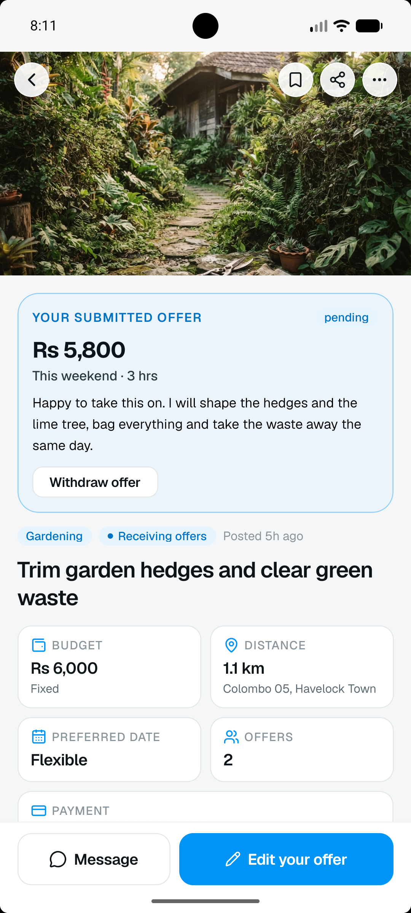

# OpenTaskit

<p align="center">
  
</p>

<p align="center">
  <strong>Local services, done right.</strong><br>
  A cross-platform peer-to-peer local task marketplace application built with React Native and Expo.
</p>

<p align="center">
  
  
  
  
  
  
  
</p>

---

## App Preview

<p align="center">
  
  
  
  
</p>

---

## Key Features

- **Dual-Sided Marketplace (Single Account)**: Seamlessly switch between "I need a service" (Task Poster) and "I provide services" (Task Provider) without maintaining separate accounts.
- **Interactive Map and Location Discovery**: Browse nearby tasks on an interactive map with cluster pins, price badges, category filtering, and customizable search radius.
- **Task Lifecycle and Offer Management**: Post tasks with multi-photo attachments, receive and compare provider offers, negotiate counter-offers, and assign providers.
- **Escrow Payment System**: Built-in wallet balance, funds held securely in escrow until task completion, multiple payout rails, and top-up methods.
- **In-App Messaging**: Direct communication between posters and providers for scheduling, updates, and deliverables.
- **Soft Minimal Design System**: Diffused theme-ink ambient shadows, Geist typography, Reanimated physics, and fluid bottom tab navigation.
- **Trust and Safety**: Identity verification status, rating and review system, task reporting, and dedicated help center.

---

## Tech Stack

- **Framework**: React Native 0.86 with Expo SDK 57
- **Routing**: Expo Router v57 (File-based typed navigation)
- **Styling**: NativeWind v4 (Tailwind CSS 3.4)
- **State Management**: Redux Toolkit and React Context API
- **Animations**: React Native Reanimated v4 and React Native Gesture Handler
- **Icons & Graphics**: Lucide Icons (`lucide-react-native`) and Expo Image
- **Maps**: Leaflet.js via `react-native-webview`
- **Media & Hardware**: `expo-image-picker`, `expo-location`, `expo-font`

---

## Project Structure

```text
opentaskit/
├── assets/
│   ├── brand/               # Brand vectors, icons, wordmarks
│   ├── fonts/               # Geist and GeistMono font family
│   └── images/              # Static app assets and badges
├── screenshots/             # Mobile application screenshots
├── src/
│   ├── app/                 # Expo Router file-based route hierarchy
│   │   ├── (auth)/          # Authentication flow (Login, Register, OTP)
│   │   ├── (screens)/       # Dedicated screens (Task details, Wallet, Chat, etc.)
│   │   ├── (tabs)/          # Bottom tab screens (Home, Discover, Post, Activity, Profile)
│   │   ├── _layout.tsx      # Root application layout and provider setup
│   │   └── index.tsx        # Initial entry point
│   ├── components/          # Modular component library
│   │   ├── brand/           # BrandMark, Lockup, and Logo components
│   │   ├── home/            # Home screen widgets and snapshot cards
│   │   ├── provider/        # Provider availability and dashboard cards
│   │   ├── task/            # TaskCard, DiscoverMap, FilterSheet, OfferList
│   │   └── ui/              # Button, Input, Chip, Avatar, BottomSheet, Overlay
│   ├── constants/           # Categories, mock data, and configuration
│   ├── contexts/            # AppContext (Dual-role state, Active Task, Wallet)
│   ├── store/               # Redux Toolkit store and slices (auth, tasks, chat)
│   ├── types/               # Global TypeScript interfaces and data models
│   └── utils/               # Helpers, formatters, and shadows configuration
├── app.json                 # Expo configuration and native permissions
├── package.json             # Dependencies and build scripts
└── tailwind.config.js       # Custom colors, typography, and theme tokens
```

---

## Getting Started

### Prerequisites

- Node.js (v18.x or higher)
- npm or yarn
- Android Studio / Android SDK (for Android build) or Xcode (for iOS build)

### 1. Installation

Clone the repository and install dependencies:

```bash
cd opentaskit
npm install
```

### 2. Verify Project Health

Run Expo Doctor to validate dependencies and configuration:

```bash
npx expo-doctor --verbose
```

### 3. Clean Native Prebuild

Generate and synchronize the native Android and iOS directories:

```bash
npx expo prebuild --clean
```

### 4. Build and Run on Connected Device

Build and launch the application directly onto a connected physical device or emulator:

#### Android

```bash
npx expo run:android
```

#### iOS

```bash
npx expo run:ios
```

---

## License

This software and associated documentation files are proprietary and confidential. All rights reserved. See [LICENSE](LICENSE) for details.
