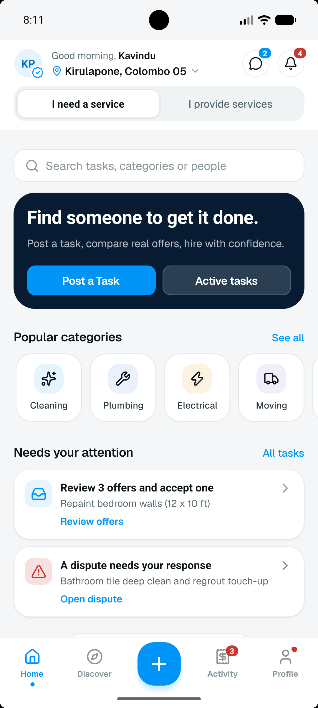
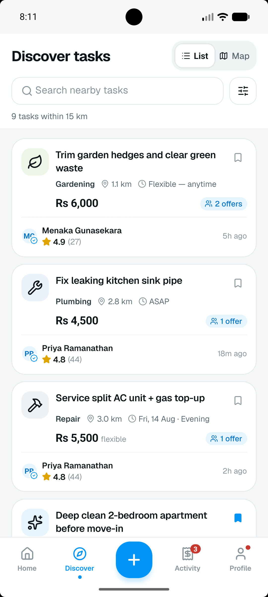
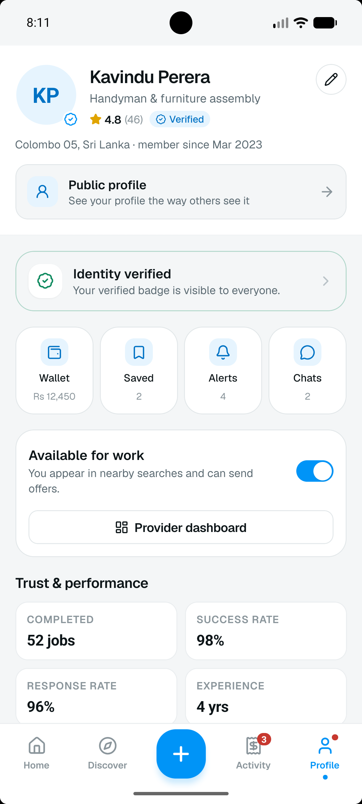
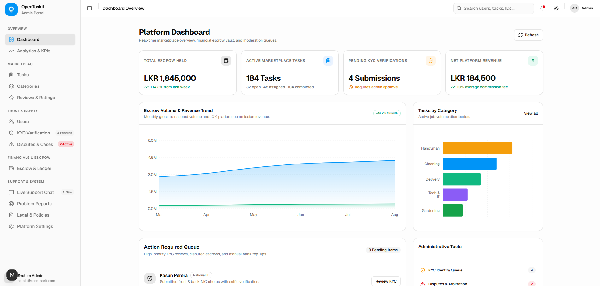

# OpenTaskit Monorepo

<p align="center">
  
</p>

<p align="center">
  <strong>Local services, done right.</strong><br>
  A peer-to-peer local task marketplace platform containing the mobile application, backend API, and administration dashboard.
</p>

<p align="center">
  
  
  
  
  
  
</p>

---

## Platform Previews

### Mobile App Experience
<p align="center">
  
  
  
  
</p>

### Admin Management Dashboard
<p align="center">
  
</p>

---

## Monorepo Packages

| Package | Technology Stack | Description | Directory |
| :--- | :--- | :--- | :--- |
| **Mobile App** | React Native 0.86, Expo SDK 57, NativeWind v4, Reanimated v4 | Cross-platform iOS and Android peer-to-peer marketplace app | [`opentaskit-app/`](./opentaskit-app) |
| **Backend API** | NestJS 11, TypeScript, Prisma ORM, PostgreSQL, Passport JWT | Central REST API, authentication, task lifecycle, and database layer | [`opentaskit-backend/`](./opentaskit-backend) |
| **Admin Dashboard** | Next.js 16 App Router, TypeScript, Tailwind CSS v4, shadcn/ui, Recharts | Web administration portal for escrow oversight, KYC verification, and disputes | [`opentaskit-admin/`](./opentaskit-admin) |

---

## Architecture and System Overview

```text
opentaskit/
├── opentaskit-app/          # Mobile Application (React Native / Expo)
│   ├── assets/              # Brand vectors, fonts, images
│   ├── screenshots/         # App preview captures
│   ├── src/                 # Screens, components, state slices, navigation
│   ├── app.json             # Expo project configuration
│   └── package.json
│
├── opentaskit-backend/      # REST API & Database Service (NestJS / Prisma)
│   ├── prisma/              # Database schema, migrations, seeders
│   ├── src/                 # Auth, categories, tasks, common utilities
│   ├── .env.example         # Template for environment configuration
│   └── package.json
│
├── opentaskit-admin/        # Administration Dashboard (Next.js / shadcn/ui)
│   ├── src/app/             # Next.js App Router admin pages
│   ├── src/components/ui/   # shadcn/ui Radix component library
│   └── package.json
│
├── .gitignore               # Unified monorepo security and ignore rules
├── LICENSE                  # Commercial proprietary license
└── README.md                # Central documentation
```

---

## Getting Started

### Prerequisites

- Node.js (v18.x or v20.x recommended)
- npm or yarn
- PostgreSQL database instance (local or hosted, e.g. Neon, Supabase, Railway)
- Android Studio / Android SDK (for mobile Android build) or Xcode (for iOS build)

---

### 1. Mobile App Setup (`opentaskit-app`)

```bash
cd opentaskit-app
npm install

# Verify project health
npx expo-doctor --verbose

# Run clean native prebuild
npx expo prebuild --clean

# Launch on connected device or emulator
npx expo run:android --device
# or
npx expo run:ios --device
```

For detailed mobile app documentation, see [`opentaskit-app/README.md`](./opentaskit-app/README.md).

---

### 2. Backend Setup (`opentaskit-backend`)

```bash
cd opentaskit-backend
npm install

# Configure environment variables
cp .env.example .env

# Generate Prisma client & apply database migrations
npx prisma migrate dev --name init
npx prisma db seed

# Start development server
npm run start:dev
```

Backend API will be running at `http://localhost:3000`. For detailed backend documentation, see [`opentaskit-backend/README.md`](./opentaskit-backend/README.md).

---

### 3. Admin Dashboard Setup (`opentaskit-admin`)

```bash
cd opentaskit-admin
npm install

# Start development server
npm run dev
```

Admin dashboard will be available at `http://localhost:3001` (or next available port).

---

## License

This software and associated documentation files are proprietary and confidential. All rights reserved. See [LICENSE](LICENSE) for details.
